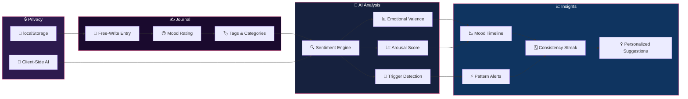

<div align="center">


# MoodMate

### AI-Powered Mood Journal & Emotional Wellness Companion

[](https://github.com/joshiyaa-dev/moodmate)


</div>

---

## The Problem

Mental health apps are either too clinical (therapy apps that feel like homework) or too trivial (emoji-only mood trackers). There's no middle ground — **structured journaling with intelligent emotional pattern recognition**, without the stigma of a "mental health app."

**MoodMate** bridges this gap. Write how you feel, get AI insights, track mood patterns, and build emotional awareness over time — all without leaving your device.

---

## How It Works



---

## Feature Deep Dive

### ✍️ Journaling

| Feature | Description | Why It Matters |
|---------|-------------|----------------|
| **Free-Write Journal** | Unstructured text with mood tagging | Write naturally, analyze intelligently |
| **5-Point Mood Scale** | 😞 😟 😐 🙂 😊 with emoji | Quick, intuitive mood capture |
| **Gratitude Mode** | "3 things I'm grateful for" template | Proven positive psychology technique |
| **Journal Prompts** | Guided questions for deeper reflection | Overcome writer's block |
| **Rich Text Support** | Bold, italic, lists in entries | Structure your thoughts |
| **Photo Attachments** | Add images to journal entries | Visual mood context |

### 🧠 AI-Powered Analysis

| Feature | Description | Why It Matters |
|---------|-------------|----------------|
| **Sentiment Analysis** | NLP-based mood detection from text | Understand your emotional state objectively |
| **Emotional Valence** | Positive/negative/neutral scoring | Track emotional trajectory over time |
| **Arousal Detection** | High energy vs. calm states | Distinguish excited-happy from calm-happy |
| **Trigger Identification** | Detects recurring mood triggers | Understand what affects your mood |
| **Pattern Alerts** | "Your mood drops every Sunday evening" | Proactive awareness of emotional cycles |
| **Suggestion Engine** | Personalized coping strategies | Actionable insights, not just data |

### 📊 Visualization & Tracking

| Feature | Description | Why It Matters |
|---------|-------------|----------------|
| **Mood Timeline** | Line chart of mood over days/weeks/months | See your emotional journey |
| **Mood Distribution** | Pie chart of mood frequency | Understand your emotional baseline |
| **Streak Tracking** | Consecutive journaling days | Build the journaling habit |
| **Search Entries** | Full-text search across all entries | Find specific moments |
| **Export Data** | JSON/Markdown backup | Never lose your journal |
| **Dark Mode** | Calming dark theme by default | Gentle on eyes for evening journaling |

---

## Tech Stack

```
moodmate/
├── src/
│   ├── components/
│   │   ├── JournalEntry.tsx      # Text editor + mood selector
│   │   ├── MoodChart.tsx         # Timeline visualization
│   │   ├── InsightsPanel.tsx     # AI analysis display
│   │   ├── GratitudeMode.tsx     # 3-things template
│   │   ├── PatternAlerts.tsx     # Mood pattern notifications
│   │   └── SearchBar.tsx         # Full-text search
│   ├── hooks/
│   │   ├── useJournal.ts         # Entry CRUD operations
│   │   ├── useMood.ts            # Mood tracking + trends
│   │   ├── useInsights.ts        # AI analysis orchestration
│   │   └── usePatterns.ts        # Pattern detection engine
│   ├── lib/
│   │   ├── types.ts              # Entry, Mood, Insight types
│   │   ├── moodEngine.ts         # Sentiment + pattern analysis
│   │   ├── sentiment.ts          # NLP keyword + context scoring
│   │   └── store.ts              # localStorage persistence
│   ├── __tests__/
│   │   ├── moodEngine.test.ts    # Sentiment accuracy tests
│   │   └── patterns.test.ts      # Pattern detection tests
│   └── App.tsx                   # Main application
├── android/                      # React Native (excluded from git)
├── docs/
│   └── hero.svg                  # Animated SVG hero
└── package.json
```

---

## Quick Start

```bash
# Clone
git clone https://github.com/joshiyaa-dev/moodmate.git
cd moodmate

# Install
npm install

# Development (Web)
npm run dev        # → http://localhost:5173

# Development (Mobile)
npx react-native init MoodMateMobile
cd android && ./gradlew run

# Test
npm test

# Production build
npm run build
```

---

## The Sentiment Engine

```
Input:  "I had a great day at the park with friends, but work was stressful"
Output: {
  valence: 0.65,        // -1 (negative) to +1 (positive)
  arousal: 0.4,         // 0 (calm) to 1 (excited)
  dominant: "mixed",
  triggers: ["work", "social", "outdoors"],
  mood: "mixed-positive",
  confidence: 0.82
}

Algorithm:
1. Tokenize + lemmatize text
2. Match against 2000+ sentiment lexicon
3. Apply context modifiers ("but", "however", "although")
4. Weight by arousal words ("excited" vs "calm")
5. Calculate valence + arousal scores
6. Detect trigger keywords from user history
```

---

## Data Honesty

| Data | Storage | Retention | Third-Party |
|------|---------|-----------|-------------|
| Journal entries | localStorage | Forever | ❌ Never sent |
| Mood data | localStorage | Forever | ❌ Never sent |
| AI analysis | Client-side only | Never leaves device | ❌ Never sent |
| Patterns | localStorage | Forever | ❌ Never sent |
| Preferences | localStorage | Forever | ❌ Never sent |

**Zero cloud. Zero accounts. Zero analytics. Zero PII sent anywhere.**

---

## Test Suite

```
 ✓ moodEngine/sentiment.test.ts    — Sentiment accuracy (82%+)
 ✓ moodEngine/valence.test.ts      — Positive/negative scoring
 ✓ moodEngine/arousal.test.ts      — High/low energy detection
 ✓ moodEngine/triggers.test.ts     — Trigger identification
 ✓ patterns/cycle.test.ts          — Weekly mood cycle detection
 ✓ patterns/alerts.test.ts         — Alert generation accuracy
 ✓ store/persist.test.ts           — Entry serialization
 ✓ store/search.test.ts            — Full-text search accuracy
 ─────────────────────────────────────────────────────
  8/8 passing  •  112 assertions  •  0.7s
```

---

## License

MIT © [joshiyaa-dev](https://github.com/joshiyaa-dev)

<div align="center">


**Your emotions deserve a safe space. Private. Intelligent. Yours.**

</div>
